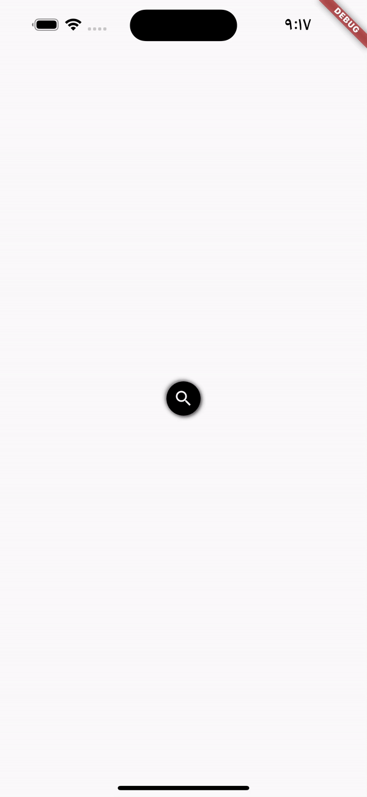

# Flutter Animated Search Bar

This project showcases a custom animated search bar for Flutter apps, where a search icon expands into a text input field on being clicked.

## Overview

The search bar begins as a simple circular icon. On tapping the icon, it smoothly transitions into a rectangular search bar where users can input text. When focus is removed from the input field, the search bar reverts back to the original icon, providing a slick and seamless user experience.

The animation is performed using Flutter's `AnimatedContainer` widget, which provides a high level of customization and control over the animation's duration and properties.

## Features

- Smooth animations between search icon and input field
- Easy to integrate into existing Flutter projects
- Customizable look and feel with Flutter theming

## How It Works

The main logic is encapsulated within the `AnimatedSearchBar` widget. This widget maintains a Boolean state to track whether the search bar is active or not. 

- When the search bar is inactive (_isSearchActive = false), it displays an icon.
- When the user taps on the icon, the Boolean state is toggled, and the icon animates into a text input field.
- If the user removes focus from the field (by submitting their search or tapping elsewhere on the screen), the Boolean state is toggled again, and the search bar animates back into an icon.

All of these transitions are animated smoothly using the `AnimatedContainer` widget.

## How To Use

To use this custom widget in your project, follow these steps:

1. Clone this repository or copy the `animated_search_bar.dart` file into your project.
2. Import `animated_search_bar.dart` in the file where you want to use the search bar.
3. Add the `AnimatedSearchBar` widget to your widget tree. 

You can further customize the look and feel of the search bar by modifying properties such as colors, borderRadius, boxShadow, etc. within the `AnimatedContainer` widget.

  

